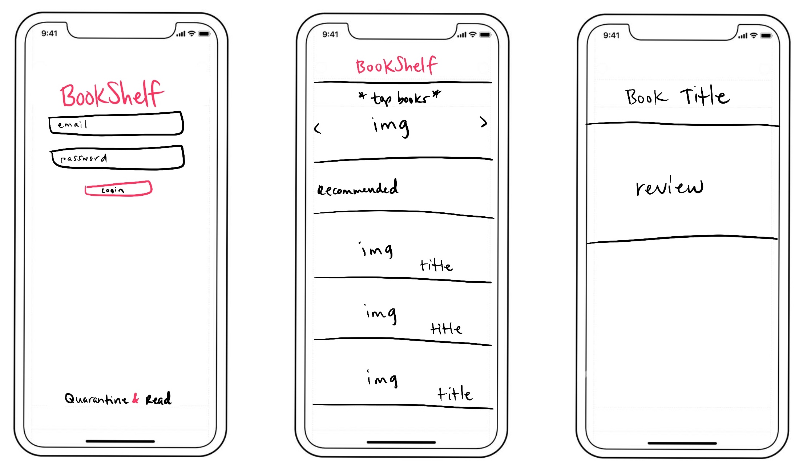

# Juniors Spring Intensive Deliverable Proposal

Dates 3/16-3/25

**My Name:** Chelsea Castelli

**Project Name:** BookShelf

**Is your project New or Old?** New

**Is your project Solo or Team?** Solo

## Description

BookShelf is an app that allows users to check out books & read reviews. Users can also save books they're interested in, to remember the titles they want to check out. Still is ideation phase..

## Challenges I Anticipate

- Dealing with API usage in Xcode & Swift for the first time
- Mastering AutoLayout & constraints
- Implementing user authentication
- Getting the data to display correctly/nicely
    - Building a design & UI I am happy with

## Skateboard
Build login screen (design only)

## Bike
- Use Firebase to make authentication functional

## Car
Once user is authenticated, the app takes them to a screen where they can see recommended or top books
   - Implement NYTimes API

## Personal Achievement Goals:

1. Implement user authentication
2. Use an external API
3. Allow user to save books they want to read or like
4. Build clean design

## Wireframes

## Evaluation

**You must meet the following criteria in order to pass the intensive:**

- Students must get proposal approved before starting the project to pass
- SOLO 
    - must score an average above a 2.5 on the [rubric]
- Pitch your product

[rubric]:https://docs.google.com/document/d/1IOQDmohLBEBT-hyr-2vgw1mbZUNsq3fHxVfH0oRmVt0/edit

## Approval Checklist
- [x] I have completed all the necessary parts of this proposal
- [x] I linked my proposal in the Spring Intensive Tracker

### Sign off

**Student Name:**                
> Chelsea Castelli 03/25/20
**Make School Adriana**
> TBD
